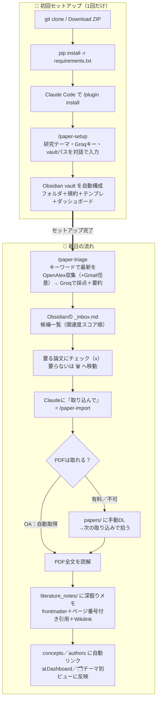

# research-pipeline

論文を自動収集し、**「候補を一覧 → 取捨選択 → 必要なものだけ Obsidian に深く取り込む」** ためのパイプライン。
**有料API不要**（採点＝Groq無料枠、深掘り＝Claude Code サブスク内の対話セッション）。Claude Code プラグインとして配布できます。

> ドキュメントの役割分担
> - **README.md**（このファイル）: 全体像
> - **[SETUP.md](SETUP.md)**: 導入手順（**まず配る人・使う人はここ**）
> - **[CLAUDE.md](CLAUDE.md)**: 運用ルール（Claude Code が守る規約）
> - **[SPEC.md](SPEC.md)**: 仕様の正
> - **[DISTRIBUTION.md](DISTRIBUTION.md)**: 配布設計（後輩への配り方・フェーズ計画）
> - **[cloudflare/SETUP.md](cloudflare/SETUP.md)**: Slack ボタン操作（任意）

---

## 何をするか（流れ図）

> GitHub 上ではこの図がそのまま描画されます（Mermaid）。



- **収集・採点・要約・inbox更新** = `/paper-triage`（毎朝の自動処理にもできる）
- **深掘り取り込み** = 「取り込んで」と言った時だけ（対話セッション＝サブスク内で無料）
- **連携先** = 各自の **Obsidian vault**（規約に従って規約準拠メモが貯まる）
- （任意）Slack DM 通知・スマホぽちぽち選別もあり（[cloudflare/SETUP.md](cloudflare/SETUP.md)）

---

## クイックスタート

セットアップは **[SETUP.md](SETUP.md)** に集約。要点だけ:

```bash
git clone https://github.com/yutohiraki/research-pipeline.git
cd research-pipeline
python3 -m pip install -r requirements.txt
# Claude Code で:
#   /plugin marketplace add ./research-pipeline
#   /plugin install research-paper-triage
#   /paper-setup     ← 研究テーマ / Groqキー / Obsidian vaultパス の3問
#   /paper-doctor    ← 健診
```

日々の流れ: `/paper-triage`（収集→採点→inbox更新）→ Obsidian で要る論文に `[x]` → `/paper-import`（PDF全文→深掘りメモ）。

必要な無料アカウント/キー（各自で発行・使い回さない）:
1. **Groq**（採点・要約）: https://console.groq.com → `groq.api_key`
2. **Gmail**（任意・アラート取得）: 2段階認証＋アプリパスワード → `gmail.address` / `gmail.app_password`
3. **Slack**（任意・通知）: Bot Token(xoxb-)＋メンバーID → `slack.bot_token` / `slack.dm_user_id`

設定は `config.example.yaml` を `config.local.yaml` にコピーして埋める（**秘匿情報・git管理外**）。

---

## 主要ファイル

| ファイル | 役割 |
|---|---|
| `config.example.yaml` | 設定テンプレ（各自 `config.local.yaml` にコピーして使う） |
| `candidate.py` | 候補データモデル（DOI/タイトル正規化・重複キー） |
| `ingest_recent.py` / `openalex_classic.py` | 最新(Gmail→OpenAlex正規化) / 古典(高被引用) の収集 |
| `triage.py` | 関連度採点＋日本語要約（Groq / Ollama / ルールベース） |
| `inbox_writer.py` | `_inbox.md` 描画（チェックリスト・🗑️除外・重複排除） |
| `triage_main.py` | 毎朝の本体（収集→採点→inbox→通知） |
| `notify_slack_dm.py` / `slack_queue.py` | Slack DM 通知・タップ結果の反映（任意） |
| `promote_check.py` | 取り込み準備（PDF確保）＋確定（取り込み済みへ移動） |
| `fetch_pdf.py` | DOI/タイトル→OA PDF を papers/ に取得（単発・別プロジェクト用） |
| `validate_note.py` | 深掘りメモの保存前バリデーション（vault汚染防止） |
| `.claude-plugin/` | プラグイン定義（self-marketplace） |
| `commands/` | スラッシュコマンド（paper-setup / paper-triage / paper-import / paper-doctor） |
| `skills/paper-note-writer` | **核心**: PDF全文→規約準拠マルチファイルメモ生成 |
| `skills/paper-pipeline-setup` | セットアップ wizard |
| `vault_starter/` | 後輩の Obsidian vault に自動コピーする雛形（CLAUDE.md規約・テンプレ・ダッシュボード） |
| `cloudflare/` | Slack ボタンの受け口 Worker（任意） |
| `_legacy/` | 旧 as-is パイプライン（Notion/Sheets中心・非使用・参考保管） |

---

## 研究テーマの変更

`config.local.yaml` の `user.research_context` を自分の言葉で書き換えるだけ（次回実行から反映）。この内容を基準に採点・要約されます。具体的に書くほど的確になります。

---

## トラブルシューティング

| 症状 | 対処 |
|---|---|
| Groq が採点しない | `groq.api_key` の有効性・429 を確認。未設定なら Ollama→ルールベースに自動フォールバック |
| 取り込みで PDF が 0 件 | 有料誌/一部OA(MDPI/Zenodo等)は自動取得不可。PDF を `papers/` に置けば次回取り込み対象 |
| 取り込み待ちが減らない | `[x]`＝チェックだけでは取り込まれない。「取り込んで」で深掘り生成 |
| 別プロジェクトで使いたい | プラグインを user スコープで入れ、`export PAPER_CONFIG=<repo>/config.local.yaml`（SETUP.md §6） |

秘匿情報（`config.local.yaml` のAPIキー・`credentials.json`・`token.json`）は git 管理外。ログ・コミット・外部送信に出さないこと。
