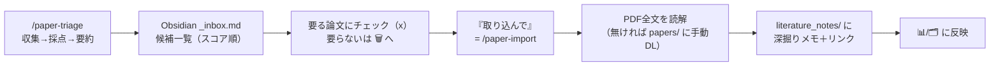

# SETUP — 後輩向けセットアップ手順

論文を自動収集→関連度採点→Obsidian に一覧化し、**採用した論文だけ**を PDF 全文から
規約準拠の深掘りメモにするパイプライン。**採点は Groq 無料枠、深掘りは Claude サブスク内**（従量課金なし）。

> このファイルは「他人が読んで再現できる」ための手順。運用ルールの正は [CLAUDE.md](CLAUDE.md)、
> 設計の正は [DISTRIBUTION.md](DISTRIBUTION.md)。

---

## 0. まず自分の環境を確認（どのレーンか）

| あなたの環境 | 採点 | 深掘りメモ | 品質 |
|---|---|---|---|
| **Claude Code ＋ Obsidian**（推奨・本命） | Groq無料枠 | Claude が PDF全文→規約準拠**マルチファイル**生成 | ◎ フル（concepts/authors/逆リンクのグラフ込み） |
| **ChatGPT/Gemini ＋ Obsidian** | 各自のGPT/Gemini | **copypaste 半自動**（web に貼る） | △ 単一メモに劣化（グラフ副作用なし）※Phase2で提供予定 |
| **Notion 派** | Groq等 | 当面は Obsidian 推奨 | Notion 深掘りは今後（候補ミラーから） |

**Claude Code が使えるなら迷わず「Claude Code ＋ Obsidian」レーン**が一番簡単で高品質。以下その手順。

---

## 0.5 先に用意するもの（初めての人向け）

- **Claude Code**（これを動かす前提）。
- **Obsidian**（無料・メモを貯める場所）: https://obsidian.md からDL → 起動して「**Create new vault**」で保管庫を1つ作る（名前と置き場所を決めるだけ）。
  → 設定（左下⚙）→ **Community plugins** を有効化 → **Dataview** を検索して Install＋Enable（ダッシュボードの表描画に必要）。
- **Groq の無料APIキー**（採点・要約用・クレカ不要）。取り方は §2 の「🔑 Groqキーの取り方」。

## 1. インストール（ほぼ全部 Claude Code の中で完結）

> **どこで実行する？** の目印:
> - 🤖 = **Claude Code のチャット欄**に打つ／頼む
> - 💻 = ふつうのターミナル（Terminal.app 等）。← 実は使わなくてもOK（下記）

**大事な前提**: Claude Code は「**選んだ作業フォルダの中**」で動きます（あなたの画面**下の「research-pipeline / main」がそれ**）。
そして `git clone` も依存インストールも **Claude に頼めば Claude がやってくれる**ので、**別のターミナルを開く必要はありません**。

手順:
1. **🤖 Claude Code を開き、作業フォルダを1つ選ぶ**（ホームや新規フォルダでOK。画面下にフォルダ名が出る）。
2. **🤖 チャットにこう頼む**（Claude が clone と pip install を実行）:
   > このリポジトリをクローンして依存を入れて: https://github.com/yutohiraki/research-pipeline.git
3. **🤖 プラグインとして登録**（スラッシュコマンド）:
   ```
   /plugin marketplace add ./research-pipeline
   /plugin install research-paper-triage      ← user スコープを選ぶと全プロジェクトで使える
   ```

<details><summary>💻 自分でターミナルでやりたい人向け（任意）</summary>

```bash
git clone https://github.com/yutohiraki/research-pipeline.git
cd research-pipeline && python3 -m pip install -r requirements.txt
```
Python が複数ある人（pyenv/conda）は `export PAPER_PYTHON=/path/to/python3` を設定しておくと確実。
その後、そのフォルダを Claude Code で開いて上の 3. を実行。
</details>

> 公開リポなので **GitHub アカウントも招待も不要**。誰でも clone / ZIP ダウンロードできます。

## 2. セットアップは「/paper-setup に答えるだけ」（設定ファイルを手で編集しない）

```
/paper-setup
```
これを実行すると **Claude が対話で全部聞いてくれます**。あなたは基本3つ答えるだけ:

1. **研究テーマ** — 「何を研究してる？ 中心テーマと関心キーワードは？」に**自分の言葉で答える**だけ。
   Claude が設定に書き込みます（**ファイルを手で開く必要なし**）。後で変えたくなったら、また Claude に「**研究テーマを◯◯に変えて**」と言えばOK。
2. **Groq キー** — 下の手順で取った `gsk_...` を貼る。
3. **Obsidian vault のパス** — 下の手順で取ったパスを貼る。
   → Claude が vault の**フォルダ構成（literature_notes / papers / concepts / authors / templates）とテンプレート・ダッシュボードを自動で作成**します（ゼロから手作業で作らなくてOK）。

Gmail / Slack / Notion は任意（後回しでOK）。まずはこの3つだけで動きます。

> 📌 **論文の入口＝あなたのキーワード**。①で入れたキーワードで **OpenAlex が「最新」も「高被引用（古典）」も自動取得**します。
> なので **Google Scholar / Web of Science のアラートを自分で設定する必要はありません**（キーワードを変えれば引っ張る論文が変わる）。
> 自分でアラートを育てている人だけ、④で Gmail を足すと精度が上がります（任意）。

### 🔑 Groqキーの取り方（クレカ不要・約3分）
1. ブラウザで **https://console.groq.com/keys** を開く
2. Google 等でサインアップ／ログイン（無料）
3. 「**Create API Key**」→ 適当な名前（例 `paper`）→ 作成
4. `gsk_...` で始まるキーが出る → **その場でコピー**（画面を閉じると二度と見られない。無くしたら作り直せばOK）
5. `/paper-setup` の質問に貼る
- ⚠️ **先輩のキーは使わない**（各自で発行。共有するとレート枯渇で全員止まる）
- キーをまだ用意できなければ「`rule` で開始」と答えれば、採点なしでも動かせます（後で追加可）。

### 📁 Obsidian vault パスの取り方（絶対パス）
- **Obsidian**: 左側で保管庫（vault）名を右クリック → 「**Reveal in Finder**」（Win: Show in system explorer）→ 開いたフォルダが vault。
- **macOS**: そのフォルダを Finder で選んで **⌘（Command）＋⌥（Option）＋C** で「パス名をコピー」。／ ターミナルにフォルダを**ドラッグ＆ドロップ**するとパスが入るのでコピーでも可。
- **Windows**: フォルダを Shift＋右クリック →「パスのコピー」。
- コピーした `/Users/あなた/.../保管庫名` のような文字列を `/paper-setup` に貼る。

## 3. 健診

```
/paper-doctor
```
python・設定・Groq 疎通・vault 書込を点検。緑になったら次へ。

## 4. 毎日の流れ



具体的なコマンド:
```
/paper-triage --preview     # まず /tmp に出して動作確認（vault に触れない）
/paper-triage               # 本番: vault の _inbox.md を更新
```
→ Obsidian で `_inbox.md` を開く → **要る論文に `[x]`**（チェック）→
```
/paper-import               # [x] した論文の PDF全文を読み、深掘りメモを生成
```

- **`[x]` を付けただけでは取り込まれない**（打ち消し線は装飾）。実際の生成は `/paper-import`。
- **二度と出したくない論文** → その行を `## 🗑️ 二度と出さない` 見出しの下へ移動（次回から永久除外）。
- 放置した新着は14日で自動消滅。
- 1日の深掘り上限は5件（`pipeline.promote_daily_limit`）。

## 5. 自動化（任意・OS別）

毎朝の自動トリアージは OS の仕組みで（**launchd 固定にしない**）:
- macOS: launchd（`com.research-pipeline.triage.plist` を参考に絶対パスを自分用に）。スリープ対策 `sudo pmset repeat wakeorpoweron MTWRFSU 07:55:00`。
- Linux: cron / systemd timer。
- Windows: タスクスケジューラ。
手動運用（`/paper-triage` を自分で叩く）でも全く問題ない。

### PDF 自動先取り（任意・往復を減らす）
✅した論文のOA PDFを日中に自動取得しておくと、取り込み時に「PDFを取ってから再依頼」の往復が消える。
テンプレ `com.research-pipeline.prefetch.plist.template` の `__PYTHON__`/`__REPO__` を自分の値に置換し:
```bash
# 置換後、~/Library/LaunchAgents/com.research-pipeline.prefetch.plist として保存し
launchctl load ~/Library/LaunchAgents/com.research-pipeline.prefetch.plist
```
中身は `promote_check.py --prepare`（**LLMなし・非課金**のPDF確保＋Slackタップ同期）だけ。Linux/Winは同コマンドをcron/タスクで。

## 6. 別プロジェクトから参考文献を取り込む（全プロジェクト共通）

別のリポジトリ/プロジェクトで作業中に出てきた参考文献も、そのまま vault に深掘りメモ化できる:
1. プラグインを **user スコープで** 入れる（`/plugin install` 時に user を選ぶ）＝どのプロジェクトでも `paper-note-writer` が効く。
2. シェルの設定（`~/.zshrc` 等）に **`export PAPER_CONFIG="/absolute/path/to/config.local.yaml"`** を追加＝cwd に依存せず自分の vault を解決。
3. 作業中に「**この論文を深掘り保存して**」（DOI/タイトル/手元PDF）→ skill が OA を自動DL（`fetch_pdf.py`）→ 全文読解 → vault にメモ生成。重複は自動チェック。
- ⚠️ **無差別に取り込まない**（vault を関係ない論文で埋めない）。保存価値を自分で判断してから。非OAは `papers/` に手動配置。

---

## 📱 Slack 通知＆スマホ選別（スマホで捌きたい人に・段階あり）

「PCで Obsidian を開いて選ぶのがだるい／通勤中にスマホで捌きたい」人向け。**2段階**あります。

| 段階 | できること | 必要なもの | 難易度 |
|---|---|---|---|
| **① 通知だけ** | 朝、Slack DM に「新着＋スコア＋要約」が届く。選別は Obsidian（PC/スマホアプリ）で `[x]` | Slack Bot Token ＋ 自分のメンバーID | かんたん（Cloudflare不要） |
| **② ぽちぽち選別** | Slack の **✅取り込む / 🗑️いらない ボタンをタップ**するだけで選別。Obsidian を開かなくていい | ①＋**無料 Cloudflare Worker のデプロイ** | 中（各自15分・[cloudflare/SETUP.md](cloudflare/SETUP.md)） |

- 設定は `config.local.yaml` の `slack.{enabled, bot_token, dm_user_id}`（①）＋ `slack.{interactive, worker_url, pull_secret}`（②）。
- ⚠️ ②の「ボタンをタップ」は **Slack の仕様上、公開URL（受け口）が必須**なので Cloudflare Worker が要ります。ここが唯一の重め設定。
- 💡 **研究室でまとめて楽にする案**: ラボで Worker を**1個だけ**立て、後輩は Slack アプリの向き先をそこに合わせるだけ（各自の Cloudflare デプロイ不要）にもできます。後輩が多いならこちらが楽。→ 必要なら実装します。

## GPT/Gemini 経路（Claude Code を使えない後輩・正直な説明）

**採点は代替できる**（各自の GPT/Gemini キー。Phase2 で `scoring_engine: openai` 等を提供予定）。
**深掘りは非対称に劣化する**。理由: 深掘りメモ生成は「ファイルを複数書く対話エージェント」が
PDF と規約を読んで literature_note＋concepts＋authors＋逆リンクを作る作業で、
**ChatGPT/Gemini の web にはその実行主体が無い**。

現実的な選択肢（優先順）:
1. **copypaste 半自動（無料・Phase2 提供予定）**: `/paper-import --export-prompt` が規約入りの
   完成プロンプトを書き出す → web LLM に貼付 → 生成メモを貼り戻す → 保存前バリデーションを通す。
   ただし **concepts/authors/逆リンクのグラフは出ず単一メモに劣化**、PDF 全文が長いとトークン超過、手数も多い。
2. **研究室の Claude 保有者に頼む**: Mac で `claude remote-control` を起動してもらい、スマホ/ブラウザから
   「◯◯を取り込んで」。品質は最高だが、その人に依存する。
3. 従量 API 自動化は**作らない**（無料方針に反し、単発 API 呼び出しではグラフ副作用を出せない）。

→ **Claude Code が使えるなら使うのが圧倒的に楽**。使えないなら「採点は自分のAI・深掘りは copypaste で単一メモ」と割り切る。

## Notion 経路（既に Notion で論文管理している後輩）

現時点は **Obsidian を推奨**。Notion は今後 `note_store: notion` で
**候補一覧のミラー**から対応予定（深掘りメモの Notion 完全対応は Obsidian と同等にはならない＝
本文ブロックや concept/author relation の追加開発が要る）。詳細は [DISTRIBUTION.md](DISTRIBUTION.md) §4b。

---

## 秘匿情報の扱い（重要）

- `config.local.yaml`（各自のキー・パス）と `config.yaml`・`credentials.json`・`token.json` は
  **git 管理外**（`.gitignore` 済み）。**チャット・コミット・共有ドライブに貼らない**。
- 初回コミット前に `git status` で秘匿ファイルが staged に無いことを必ず確認する。
- 配布時に共有するのは `config.example.yaml`（キーを剥がしたテンプレ）だけ。
