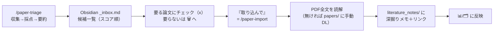

# SETUP — 後輩向けセットアップ手順

論文を自動収集→関連度採点→Obsidian に一覧化し、**採用した論文だけ**を PDF 全文から
規約準拠の深掘りメモにするパイプライン。**採点は Groq 無料枠、深掘りは Claude サブスク内**（従量課金なし）。

> このファイルは「他人が読んで再現できる」ための手順。運用ルールの正は [CLAUDE.md](CLAUDE.md)、
> 設計の正は [DISTRIBUTION.md](DISTRIBUTION.md)。

---

## 📖 目次（全体像）

> **セットアップは初回1回だけ**。必須は **§1〜§3 ＋ §5** の実質4ステップ（合計15〜20分ほど）。§6以降は任意（あとで足せる）。

**■ 準備**
- **§0** どのレーンか確認（`Claude Code × Obsidian` が本命）
- **§0.5** 先に用意するもの（Obsidian・Groq 無料キー）

**■ 初回セットアップ〈必須〉**
- **§1** インストール（Claude Code 入手 → 作業フォルダ作成 → プラグイン登録）
- **§2** `/paper-setup` に答える（研究テーマ・Groqキー・vaultパス）
- **§3** `/paper-doctor` で健診
- **§5** トリアージ自動化（毎朝ほっといても最新が並ぶ）

**■ 毎日の使い方**
- **§4** triage → 要る論文にチェック → 「取り込んで」

**■ 任意〈あとで足す〉**
- **§6** Slack 通知＆スマホ選別（**竹山研は②ぽちぽちを推奨**）
- **§7** 別プロジェクトから参考文献を取り込む

**■ 別レーン・参考**
- GPT/Gemini 経路 ／ Notion 経路 ／ 秘匿情報の扱い

---

## 0. まず自分の環境を確認（どのレーンか）

| あなたの環境 | 採点 | 深掘りメモ | 品質 |
|---|---|---|---|
| **Claude Code ＋ Obsidian**（推奨・本命） | Groq無料枠 | Claude が PDF全文→規約準拠**マルチファイル**生成 | ◎ フル（concepts/authors/逆リンクのグラフ込み） |
| **ChatGPT/Gemini ＋ Obsidian** | 各自のGPT/Gemini | **copypaste 半自動**（web に貼る） | △ 単一メモに劣化（グラフ副作用なし）※Phase2で提供予定 |
| **Notion 派** | Groq等 | 当面は Obsidian 推奨 | Notion 深掘りは今後（候補ミラーから） |

**Claude Code が使えるなら迷わず「Claude Code ＋ Obsidian」レーン**が一番簡単で高品質。以下その手順。

---

## 0.5 先に用意するもの（初めての人向け）

- **Claude Code**（これを動かす前提）。
- **Obsidian**（無料・メモを貯める場所）: https://obsidian.md からDL → 起動して「**Create new vault**」で保管庫を1つ作る（名前と置き場所を決めるだけ）。
  → 設定（左下⚙）→ **Community plugins** を有効化 → **Dataview** を検索して Install＋Enable（ダッシュボードの表描画に必要）。
- **Groq の無料APIキー**（採点・要約用・クレカ不要）。取り方は §2 の「🔑 Groqキーの取り方」。

## 1. インストール

> **どこで実行する？** の目印: 🤖 = **Claude Code のチャット欄**に打つ／頼む ／ 💻 = ふつうのターミナル。

### 1-1. Claude Code 本体を入手（初めてなら 🖥 **デスクトップアプリ推奨**）
Claude Code にはいくつか形態があり、**非技術者はデスクトップアプリが一番かんたん**（クリックでフォルダ選択・変更差分が見やすい・**ターミナル不要**）。

- **🖥 デスクトップアプリ（Mac / Windows・推奨）**
  - ダウンロード: [Mac](https://claude.ai/api/desktop/darwin/universal/dmg/latest/redirect) ／ Windows [x64](https://claude.ai/api/desktop/win32/x64/setup/latest/redirect)・[ARM64](https://claude.ai/api/desktop/win32/arm64/setup/latest/redirect)
  - インストール → 起動 → **Claude サブスク（Pro / Max 等）でログイン** → 上部の **Code** タブ → **作業フォルダを選ぶ**
    （選ぶと画面下にフォルダ名が出る＝それが作業フォルダ。あなたの画面の「research-pipeline / main」がこれ）。
- **⌨️ ターミナル（CLI）派**（ターミナルに慣れている人向け）
  - インストール（どれか1つ）:
    ```bash
    curl -fsSL https://claude.ai/install.sh | bash     # Mac / Linux（自動更新・推奨）
    brew install --cask claude-code                     # Homebrew 派（更新は手動）
    # Windows は PowerShell で: irm https://claude.ai/install.ps1 | iex
    ```
  - 作業フォルダに入って起動: `cd <フォルダ> && claude`（初回はブラウザでログイン）。

> **スラッシュコマンド（`/plugin`・`/paper-setup` 等）はデスクトップ・CLI どちらでも同じ**に動きます。以下は共通。

### 1-2. 作業フォルダを用意する（新しく作ってOK・参考例）
Claude Code で使う作業フォルダは **新規に作ってOK**。分かりやすい場所に専用フォルダを1つ作るのがおすすめです（例: 名前を `paper-pipeline`）。

- **🖥 Finder で作る（デスクトップアプリ派）**:
  Finder を開く → 左の「**書類（Documents）**」を選ぶ → メニュー **ファイル → 新規フォルダ**（ショートカット **⌘⇧N**）→ 名前を `paper-pipeline` にする。
- **⌨️ ターミナルで作る（CLI派）**:
  ```bash
  mkdir -p ~/Documents/paper-pipeline && cd ~/Documents/paper-pipeline
  ```

この `paper-pipeline` を **作業フォルダ**にします:
- デスクトップアプリ → **Code タブでこのフォルダを選択**（画面下にフォルダ名が出る）
- CLI → **このフォルダの中で `claude` を起動**

次（1-3）で、この中にリポジトリを置きます（`paper-pipeline/research-pipeline/` ができる）。

### 1-3. リポジトリ取得＋プラグイン登録
**前提**: Claude Code は「選んだ作業フォルダの中」で動きます。`git clone` も依存インストールも **Claude に頼めば Claude がやる**ので、別ターミナルは基本不要です。

1. **🤖 1-2 で作った作業フォルダ（`paper-pipeline`）を Claude Code で開く**。
2. **🤖 チャットにこう頼む**（Claude が clone と `pip install` を実行）:
   > このリポジトリをクローンして依存を入れて: https://github.com/yutohiraki/research-pipeline.git
3. **🤖 プラグイン登録**:
   ```
   /plugin marketplace add ./research-pipeline
   /plugin install research-paper-triage      ← user スコープを選ぶと全プロジェクトで使える
   ```
   （デスクトップアプリなら **Plugins パネル**からも入っているか確認できます）

<details><summary>💻 最初から全部ターミナルでやる派（CLI・任意）</summary>

```bash
git clone https://github.com/yutohiraki/research-pipeline.git
cd research-pipeline
python3 -m pip install -r requirements.txt
claude                                   # このフォルダで Claude Code CLI を起動
# 起動後（今このフォルダにいるので marketplace は "." でOK）:
#   /plugin marketplace add .
#   /plugin install research-paper-triage
```
Python が複数ある人（pyenv/conda）は `export PAPER_PYTHON=/path/to/python3` を設定しておくと確実。
</details>

> 公開リポなので **GitHub アカウントも招待も不要**。誰でも clone / ZIP ダウンロードできます。

## 2. セットアップは「/paper-setup に答えるだけ」（設定ファイルを手で編集しない）

```
/paper-setup
```
これを実行すると **Claude が対話で全部聞いてくれます**。あなたは基本3つ答えるだけ:

1. **研究テーマ** — 「何を研究してる？ 中心テーマと関心キーワードは？」に**自分の言葉で答える**だけ。
   Claude が設定に書き込みます（**ファイルを手で開く必要なし**）。後で変えたくなったら、また Claude に「**研究テーマを◯◯に変えて**」と言えばOK。
2. **Groq キー** — 下の手順で取った `gsk_...` を貼る。
3. **Obsidian vault のパス** — 下の手順で取ったパスを貼る。
   → Claude が vault の**フォルダ構成（literature_notes / papers / concepts / authors / templates）とテンプレート・ダッシュボードを自動で作成**します（ゼロから手作業で作らなくてOK）。

Gmail / Slack / Notion は任意（後回しでOK）。まずはこの3つだけで動きます。

> 📌 **論文の入口＝あなたのキーワード**。①で入れたキーワードで **OpenAlex が「最新」も「高被引用（古典）」も自動取得**します。
> なので **Google Scholar / Web of Science のアラートを自分で設定する必要はありません**（キーワードを変えれば引っ張る論文が変わる）。
> 自分でアラートを育てている人だけ、④で Gmail を足すと精度が上がります（任意）。

### 🔑 Groqキーの取り方（クレカ不要・約3分）
1. ブラウザで **https://console.groq.com/keys** を開く
2. Google 等でサインアップ／ログイン（無料）
3. 「**Create API Key**」→ 適当な名前（例 `paper`）→ 作成
4. `gsk_...` で始まるキーが出る → **その場でコピー**（画面を閉じると二度と見られない。無くしたら作り直せばOK）
5. `/paper-setup` の質問に貼る
- ⚠️ **先輩のキーは使わない**（各自で発行。共有するとレート枯渇で全員止まる）
- キーをまだ用意できなければ「`rule` で開始」と答えれば、採点なしでも動かせます（後で追加可）。

### 📁 Obsidian vault パスの取り方（絶対パス）
- **Obsidian**: 左側で保管庫（vault）名を右クリック → 「**Reveal in Finder**」（Win: Show in system explorer）→ 開いたフォルダが vault。
- **macOS**: そのフォルダを Finder で選んで **⌘（Command）＋⌥（Option）＋C** で「パス名をコピー」。／ ターミナルにフォルダを**ドラッグ＆ドロップ**するとパスが入るのでコピーでも可。
- **Windows**: フォルダを Shift＋右クリック →「パスのコピー」。
- コピーした `/Users/あなた/.../保管庫名` のような文字列を `/paper-setup` に貼る。

## 3. 健診

```
/paper-doctor
```
python・設定・Groq 疎通・vault 書込を点検。緑になったら次へ。

## 4. 毎日の流れ



具体的なコマンド:
```
/paper-triage --preview     # まず /tmp に出して動作確認（vault に触れない）
/paper-triage               # 本番: vault の _inbox.md を更新
```
→ Obsidian で `_inbox.md` を開く → **要る論文に `[x]`**（チェック）→
```
/paper-import               # [x] した論文の PDF全文を読み、深掘りメモを生成
```

- **`[x]` を付けただけでは取り込まれない**（打ち消し線は装飾）。実際の生成は `/paper-import`。
- **二度と出したくない論文** → その行を `## 🗑️ 二度と出さない` 見出しの下へ移動（次回から永久除外）。
- 放置した新着は14日で自動消滅。
- 1日の深掘り上限は5件（`pipeline.promote_daily_limit`）。

## 5. トリアージ自動化（必須・毎朝ほっといても最新論文が inbox に並ぶ）

**トリアージ（収集→採点→要約→inbox更新→通知）は毎日の自動実行を必須**にする（放っておいても最新が貯まる＝本ツールの核）。
採点は Groq 無料枠なので**自動化しても課金ゼロ**。深掘り取り込みだけは対話なので手動のまま。

- **macOS（launchd）**: テンプレ `com.research-pipeline.triage.plist.template` の `__PYTHON__`（`which python3` の結果）と `__REPO__`（リポジトリの絶対パス）を置換し:
  ```bash
  # 置換後 ~/Library/LaunchAgents/com.research-pipeline.triage.plist として保存し
  launchctl load ~/Library/LaunchAgents/com.research-pipeline.triage.plist
  # （任意）Mac が寝ていても動くよう 07:55 に自動起床:
  sudo pmset repeat wakeorpoweron MTWRFSU 07:55:00
  ```
  → **`/paper-setup` の中で「自動化も設定して」と頼めば、Claude がこの置換・保存・load を手伝います**。
- **Linux**: cron に `0 8 * * * cd __REPO__ && python3 triage_main.py`（or systemd timer）。
- **Windows**: タスクスケジューラで毎朝 `python3 __REPO__\triage_main.py`。

> 最低ライン（どうしても設定できない時）: 毎朝 `/paper-triage` を自分で1回叩く。ただし自動化しないと貯まらないので**設定を強く推奨**。

### PDF 自動先取り（任意・往復を減らす）
✅した論文のOA PDFを日中に自動取得しておくと、取り込み時に「PDFを取ってから再依頼」の往復が消える。
テンプレ `com.research-pipeline.prefetch.plist.template` の `__PYTHON__`/`__REPO__` を自分の値に置換し:
```bash
# 置換後、~/Library/LaunchAgents/com.research-pipeline.prefetch.plist として保存し
launchctl load ~/Library/LaunchAgents/com.research-pipeline.prefetch.plist
```
中身は `promote_check.py --prepare`（**LLMなし・非課金**のPDF確保＋Slackタップ同期）だけ。Linux/Winは同コマンドをcron/タスクで。

## 6. 📱 Slack 通知＆スマホ選別（§5 の自動実行の結果をここで受ける）

§5 の朝の自動トリアージの結果を Slack DM で受け取り、スマホで捌けるようにする。**2段階**:

| 段階 | できること | 必要なもの | 難易度 |
|---|---|---|---|
| **① 通知だけ** | 朝、Slack DM に「新着＋スコア＋要約」が届く。選別は Obsidian で `[x]` | Slack Bot Token ＋ 自分のメンバーID | かんたん（Cloudflare不要） |
| **② ぽちぽち選別** | Slack の **✅取り込む / 🗑️いらない ボタンをタップ**するだけで選別。Obsidian を開かなくていい | ①＋ラボ共有 Worker に config を貼るだけ | 後輩は**かんたん** |

> **設定は手でファイルを編集しません。** Claude Code で「**Slackを設定して**」と言う（または `/paper-setup` の中）だけ。
> Claude が下の値を1つずつ聞いて `config.local.yaml` に書きます。

- ⭐ **竹山研メンバーは ② を推奨**。ラボの共有 Cloudflare Worker があるので、用意するのは次の4つだけ:
  1. **先輩（管理者）からもらう**: `bot_token`（`xoxb-…`）／ `worker_url`（`https://…workers.dev`）／ `pull_secret`（合言葉）
     ※これは全員共通。先輩が Slack のピン留めや共有メモで配ります。
  2. **自分の Slack メンバーID**: Slack で自分のプロフィール →「…（その他）」→「**メンバーIDをコピー**」（`U…`）
  → この4つを Claude に伝えるだけ。**Cloudflare も Slack アプリ作成も不要**。（内部で `slack.{enabled,interactive,bot_token,worker_url,pull_secret,dm_user_id}` に入ります）
- 値がまだ配られていなければ、まず ①（`bot_token` と 自分のメンバーID だけ・通知のみ）で始めて、後で②に上げればOK。
- 竹山研以外／個人で試す人は ① から。②を自前で立てたい人は [cloudflare/SETUP.md](cloudflare/SETUP.md) の「【管理者】」も自分でやる。

## 7. 別プロジェクトから参考文献を取り込む（全プロジェクト共通）

別のリポジトリ/プロジェクトで作業中に出てきた参考文献も、そのまま vault に深掘りメモ化できる:
1. プラグインを **user スコープで** 入れる（`/plugin install` 時に user を選ぶ）＝どのプロジェクトでも `paper-note-writer` が効く。
2. シェルの設定（`~/.zshrc` 等）に **`export PAPER_CONFIG="/absolute/path/to/config.local.yaml"`** を追加＝cwd に依存せず自分の vault を解決。
3. 作業中に「**この論文を深掘り保存して**」（DOI/タイトル/手元PDF）→ skill が OA を自動DL（`fetch_pdf.py`）→ 全文読解 → vault にメモ生成。重複は自動チェック。
- ⚠️ **無差別に取り込まない**（vault を関係ない論文で埋めない）。保存価値を自分で判断してから。非OAは `papers/` に手動配置。

## GPT/Gemini 経路（Claude Code を使えない後輩・正直な説明）

**採点は代替できる**（各自の GPT/Gemini キー。Phase2 で `scoring_engine: openai` 等を提供予定）。
**深掘りは非対称に劣化する**。理由: 深掘りメモ生成は「ファイルを複数書く対話エージェント」が
PDF と規約を読んで literature_note＋concepts＋authors＋逆リンクを作る作業で、
**ChatGPT/Gemini の web にはその実行主体が無い**。

現実的な選択肢（優先順）:
1. **copypaste 半自動（無料・Phase2 提供予定）**: `/paper-import --export-prompt` が規約入りの
   完成プロンプトを書き出す → web LLM に貼付 → 生成メモを貼り戻す → 保存前バリデーションを通す。
   ただし **concepts/authors/逆リンクのグラフは出ず単一メモに劣化**、PDF 全文が長いとトークン超過、手数も多い。
2. **研究室の Claude 保有者に頼む**: Mac で `claude remote-control` を起動してもらい、スマホ/ブラウザから
   「◯◯を取り込んで」。品質は最高だが、その人に依存する。
3. 従量 API 自動化は**作らない**（無料方針に反し、単発 API 呼び出しではグラフ副作用を出せない）。

→ **Claude Code が使えるなら使うのが圧倒的に楽**。使えないなら「採点は自分のAI・深掘りは copypaste で単一メモ」と割り切る。

## Notion 経路（既に Notion で論文管理している後輩）

現時点は **Obsidian を推奨**。Notion は今後 `note_store: notion` で
**候補一覧のミラー**から対応予定（深掘りメモの Notion 完全対応は Obsidian と同等にはならない＝
本文ブロックや concept/author relation の追加開発が要る）。詳細は [DISTRIBUTION.md](DISTRIBUTION.md) §4b。

---

## 秘匿情報の扱い（重要）

- `config.local.yaml`（各自のキー・パス）と `config.yaml`・`credentials.json`・`token.json` は
  **git 管理外**（`.gitignore` 済み）。**チャット・コミット・共有ドライブに貼らない**。
- 初回コミット前に `git status` で秘匿ファイルが staged に無いことを必ず確認する。
- 配布時に共有するのは `config.example.yaml`（キーを剥がしたテンプレ）だけ。
